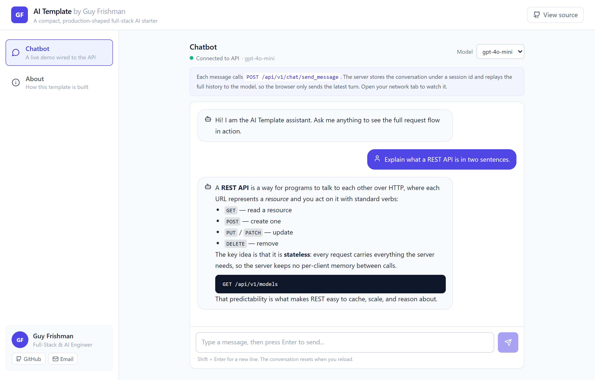
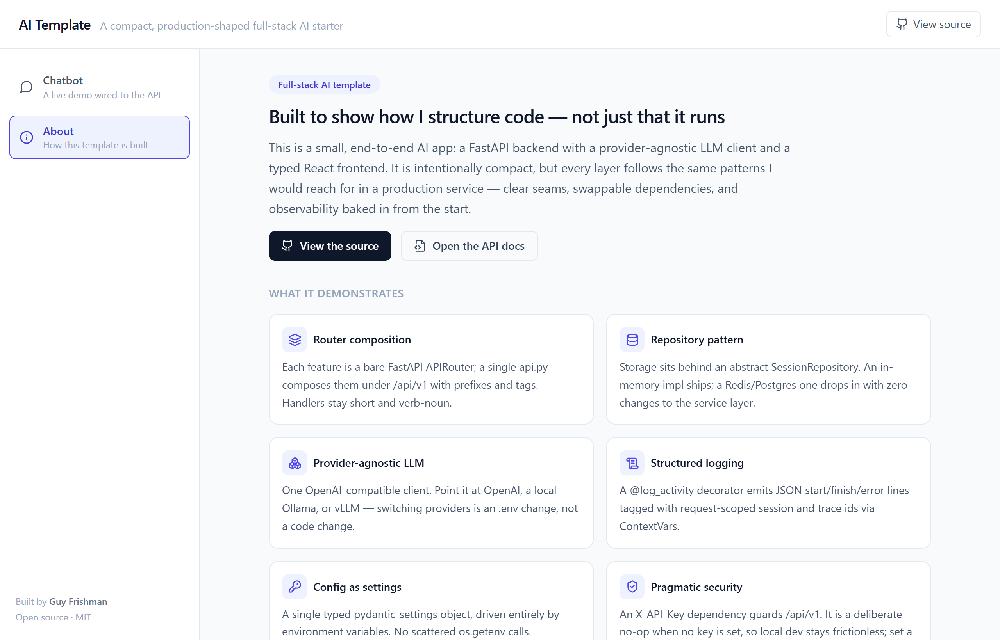

# AI Fullstack Template

[](https://github.com/guyfrishman/ai-fullstack-template/actions/workflows/ci.yml)
[](LICENSE)
[](https://www.python.org/)
[](https://react.dev/)

A clean, production-shaped starting point for AI applications: a **FastAPI**
backend with a provider-agnostic LLM client, and a **React + Vite + TypeScript +
Tailwind** frontend with a working chat UI. Runs locally with one command, and
works fully offline against a local model.

```
ai-fullstack-template/
├── api/                 # FastAPI service (package: app)
├── ui/                  # React + Vite + TypeScript + Tailwind
├── docs/                # onboarding, conventions, ADRs, per-service reference
├── docker-compose.yml   # api + ui, one command
├── LICENSE              # MIT
└── README.md
```

The [`docs/`](docs/) folder is a first-class part of this template: it captures
how the code is written and *why* it's built this way, for both human
contributors and AI coding agents. See [Documentation](#documentation) below.



<details>
<summary>More screenshots</summary>



</details>

## Why this template

It demonstrates a small set of patterns that scale well as a service grows:

- **Router composition** — each feature is a bare `APIRouter()`; a single
  `routers/api.py` composes them under `/api/v1` with `prefix`/`tags`. Handlers
  stay short and verb-noun; every route has a `summary`.
- **Repository pattern** — storage sits behind interfaces. `SessionRepository`
  is abstract with an in-memory implementation shipped; a DB-backed store drops
  in without touching the service layer. The LLM client is its own repository,
  so the provider is an implementation detail.
- **Provider-agnostic LLM** — one OpenAI-compatible client. Point it at OpenAI,
  a local **Ollama**, vLLM, LM Studio — anything that speaks the OpenAI
  protocol. Switching providers is an `.env` change, not a code change.
- **Config** — `pydantic-settings` with a single typed `Settings` object,
  driven entirely by environment variables.
- **Structured logging** — a `@log_activity` decorator emits JSON
  STARTING/FINISHED/ERROR lines, tagged with request-scoped `session_id` and
  `trace_id` via `ContextVars`, so a request is traceable across async calls.
- **Security** — an `X-API-Key` dependency guards `/api/v1/*`. It is a **no-op
  (open) when `API_ACCESS_KEY` is unset**, so local development needs no keys;
  set the key to lock the API down.
- **Graceful degradation** — `GET /api/v1/models` lists what the provider
  serves, and falls back to the default model if the provider can't be reached,
  rather than returning a 500.

## API surface

| Method | Path                        | Auth        | Description                       |
| ------ | --------------------------- | ----------- | --------------------------------- |
| GET    | `/ping`                     | open        | Liveness check                    |
| POST   | `/api/v1/chat/init`         | key (if set)| Create a chat session             |
| POST   | `/api/v1/chat/send_message` | key (if set)| Send a message, get a reply       |
| GET    | `/api/v1/models`            | key (if set)| List available models             |
| GET    | `/api/v1/settings`          | key (if set)| Safe, non-secret configuration    |

## Quickstart

### Option 1 — Docker Compose (both services)

```bash
cp api/.env.example api/.env     # then edit api/.env with your provider settings
docker compose up --build
```

- UI: http://localhost:5173
- API docs: http://localhost:8000/docs

### Option 2 — Run each service manually

**API** (needs [uv](https://docs.astral.sh/uv/)):

```bash
cd api
cp .env.example .env
uv sync
uv run uvicorn main:app --reload      # http://localhost:8000
```

**UI** (needs Node 20+):

```bash
cd ui
cp .env.example .env
npm install
npm run dev                            # http://localhost:5173
```

## Choosing a model provider

The backend uses one OpenAI-compatible client. Configure it in `api/.env`:

**OpenAI**

```env
OPENAI_API_KEY=sk-...
OPENAI_BASE_URL=https://api.openai.com/v1
DEFAULT_MODEL=gpt-4o-mini
```

**Local / offline with Ollama** — no API key, nothing leaves your machine:

```bash
ollama pull llama3.2
ollama serve
```

```env
OPENAI_BASE_URL=http://localhost:11434/v1
DEFAULT_MODEL=llama3.2
```

That's the only change needed to go fully offline.

## Tests

```bash
cd api && uv run pytest
```

Tests mock the LLM client, so they run with no network and no API key.

## Documentation

This repo treats documentation as a system, not an afterthought. Everything
cross-cutting lives in [`docs/`](docs/) and is structured so a human or an AI
agent can get the answer — and the *reasoning* behind it — in under a minute.

```
docs/
├── onboarding.md     # day-1 reading list, get productive in < 1 hour
├── AGENTS.md         # how AI coding agents should work here
├── conventions/      # how the code is written (authoritative)
├── decisions/        # ADRs — why it's built this way (append-only)
├── services/         # per-unit reference + example/planned services
├── patterns/         # worked examples of extending the template
└── infrastructure/   # CI/CD, containers, deployment, observability
```

### How to leverage it

**New to the project?** Start at [`docs/onboarding.md`](docs/onboarding.md) — it
gives you the mental model, the 5-minute run, and a reading order. Then skim
[`docs/conventions/`](docs/conventions/) (they're short) and read the
[`docs/services/`](docs/services/) file for the part you're touching.

**Using a coding agent?** The repo is built to be worked on by any AI coding
assistant (Claude Code, Cursor, Windsurf, Copilot, Aider, …) — nothing here is
tied to a specific tool. To get changes that match the existing style, point the
agent at the docs and hold it to the house rules below:

- Read [`docs/AGENTS.md`](docs/AGENTS.md) first, then the relevant
  [`docs/conventions/`](docs/conventions/) files and the
  [`docs/services/`](docs/services/) file for the part being changed.
- **House rules** (the short version of `docs/AGENTS.md`):
  - **Thin layers** — routers delegate to services; services orchestrate;
    repositories own I/O. Don't cross those lines.
  - **Talk to the model only through `LlmRepository`** and to storage only
    through `SessionRepository`; the provider and datastore are swappable behind
    them.
  - **`@log_activity` on functions in the request path**; never `print`.
  - **Config is one typed `Settings` object** from env vars; secrets never go in
    code or the `/settings` response.
  - **Verify, don't assert** — `uv run pytest` and `npm run build` stay green;
    run the thing you changed.
  - **No proprietary or cloud-coupled content** — this is a public template.
- Most assistants auto-load a context file from the repo root; if yours does,
  copy these rules into the file it expects (e.g. `AGENTS.md`, or a tool-specific
  one) so they're picked up automatically.
- Example prompt to try:
  > "Read `docs/conventions/routers.md` and `docs/conventions/repositories.md`,
  > then add a `GET /api/v1/chat/{session_id}/history` endpoint that returns the
  > stored messages, following the existing patterns."

**Extending the template?** Conventions are authoritative — if code disagrees
with a convention, either the code is wrong or the convention changed. When you
change a rule, record *why* as a new ADR in [`docs/decisions/`](docs/decisions/)
(append-only) and update the convention. That trail is what keeps the codebase
coherent as it grows.

**Understanding a design choice?** [`docs/decisions/`](docs/decisions/) explains
the non-obvious calls — why the LLM client is provider-agnostic, why history is
server-side, why auth is open by default — each with the alternatives that were
weighed.

**Scaling it up?** [`docs/patterns/`](docs/patterns/) has worked examples of
extending the template behind its existing interfaces — a Redis or Postgres
session store, a RAG vector-store repository — and
[`docs/services/`](docs/services/) sketches how it grows into a small
multi-service architecture (a background worker, a retrieval API).

**Shipping it?** [`docs/infrastructure/`](docs/infrastructure/) covers what's
wired up (a GitHub Actions CI pipeline that tests the API and builds the UI) and
the suggested path to production — container strategy, deployment targets
(managed containers, Kubernetes), CD, and observability.

## License

MIT — see [LICENSE](LICENSE).
